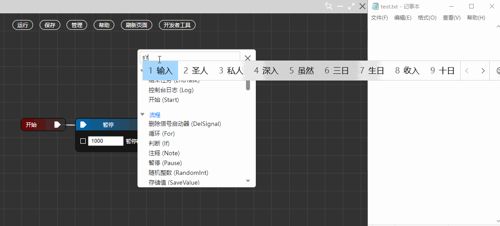

  <h1>源核</img></h1>

[![Contributors][contributors-shield]][contributors-url]
[![Forks][forks-shield]][forks-url]
[![Stargazers][stars-shield]][stars-url]
[![Issues][issues-shield]][issues-url]
[![MIT License][license-shield]][license-url]

[your-project-path]:dLwuren/source-core
[contributors-shield]: https://img.shields.io/github/contributors/dLwuren/source-core.svg?style=flat-square
[contributors-url]: https://github.com/dLwuren/source-core/graphs/contributors
[forks-shield]: https://img.shields.io/github/forks/dLwuren/source-core.svg?style=flat-square
[forks-url]: https://github.com/dLwuren/source-core/network/members
[stars-shield]: https://img.shields.io/github/stars/dLwuren/source-core.svg?style=flat-square
[stars-url]: https://github.com/dLwuren/source-core/stargazers
[issues-shield]: https://img.shields.io/github/issues/dLwuren/source-core.svg?style=flat-square
[issues-url]: https://img.shields.io/github/issues/dLwuren/source-core.svg
[license-shield]: https://img.shields.io/github/license/dLwuren/source-core.svg?style=flat-square
[license-url]: https://github.com/dLwuren/source-core/blob/master/LICENSE.txt

「源核」是一款 Windows 平台下的效率工具，能够自动操控电脑键盘与鼠标。用户只需通过「可视化编程」的方式即可轻松创建自动化任务。

## 👉 特点
- 仅支持 Windows 系统，依赖于系统的 webview（通常 Windows 自带）。
- 应用大小约 50 MB。
- 绿色软件，无需安装，双击即用。
- 主要使用前端技术，易于二次开发。
- 丰富的节点，基本能够满足使用需求。
- 外部应用、脚本可通过发送 post 请求来调用该应用。
- 上手难度适中，只需了解一些基本概念，即可完全上手。

## 🥳 使用
下载：https://github.com/dLwuren/source-core/releases/
文档：https://dlwuren.github.io/doc-yh/

## 🎈 交流
交流 Q 群 `773213775`，或是搜索群名 `源核，启动`，加群验证信息直接填 `yh` 即可。话说现在还有人用 QQ 吗 👀？微信群总感觉不如 QQ 群好用唉所以用 QQ 群了。

在群里可以随便聊聊，不一定要与编程相关。

## 🙏 鸣谢
感谢下列开源项目的作者，他们优秀的项目对我有很大的启发。

- Rubick ：基于 Electron 开源的插件化工具箱。
- Niva：一个基于 Tauri WRY 跨端 Webview 库的超轻量极易用的跨端应用开发框架。
- jsgp：js 可视化编程。
- mind-map：一个强大的 Web 思维导图。
- ……

## License
MIT
